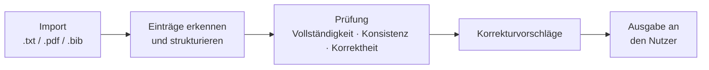

# BOBR – Back-check Of Bibliographic Records

> Open-Source-Werkzeug mit grafischer Oberfläche, das Literaturverzeichnisse auf formale Vollständigkeit, Konsistenz und Korrektheit prüft und Korrekturvorschläge macht.

**Status:** Konzeptionsphase

---

## Problemstellung

In Forschungsprojekten, wissenschaftlichen und studentischen Arbeiten sowie Forschungsanträgen kommen durch manuelle und (teil-)automatisierte Recherche schnell große Mengen an Quellen zusammen. Editoren, Gutachter und Autoren stehen dann vor der Frage, wie sich solche Literaturlisten effizient auf formale Vollständigkeit, Konsistenz und Korrektheit prüfen und korrigieren lassen.

Bestehende Tools wie [GROBID](https://github.com/kermitt2/grobid) decken nur Teile dieses Prozesses ab. Andere Lösungen sind kostenpflichtig oder für nicht-technische Anwender zu komplex.

## Ziel

BOBR soll bibliographische Daten einlesen, prüfen und dem Nutzer verständliche Korrekturvorschläge liefern, und zwar über eine einfache grafische Oberfläche.

## Funktionsumfang (geplant)

**Kernfunktionen**

- Import von Literaturdaten aus `.txt`, `.pdf` und `.bib`
- Prüfung auf **Vollständigkeit**, z. B. fehlende Pflichtangaben
- Prüfung auf **Konsistenz**, z. B. einheitliche Schreibweisen und Formate
- Prüfung auf **Korrektheit** der Angaben
- Korrekturvorschläge, übersichtlich für den Nutzer aufbereitet
- Grafische Oberfläche, die auch ohne technische Vorkenntnisse bedienbar ist

**Erweiterungen (wenn möglich)**

- Erkennen, welche der verwendeten Quellen sich gegenseitig zitieren
- Verknüpfungen zwischen Quellen, Autoren und Gutachtern prüfen und mögliche Interessenkonflikte aufzeigen

**Nicht Teil des Projekts**

- Inhaltliche Prüfung, also ob eine Aussage tatsächlich durch die zitierte Quelle belegt wird

## Ablauf (Konzept)

## Installation

Folgt mit dem ersten Release. Geplant sind fertige Programme für **Windows** und **macOS** zum Download unter [Releases](../../releases).

## Technologie

Wird in der Konzeptionsphase festgelegt. Bestehende Open-Source-Bausteine wie GROBID werden dabei geprüft.

## Projektorganisation

- **Aufgaben und Fortschritt:** GitHub Projects → [Projektboard](LINK-ZUM-BOARD)
- **Fehler, Ideen, Fragen:** über [Issues](../../issues)

## Meilensteine

| Zeitpunkt | Meilenstein |
|---|---|
| Ende 5. Semester | Zwischenpräsentation |
| Ende 6. Semester | Abschlusspräsentation und Abgabe der schriftlichen Ausarbeitung |

## Projektkontext

Studentisches Projekt im Studiengang Wirtschaftsinformatik – Business Engineering an der [DHBW Ravensburg](https://www.dhbw-ravensburg.de) (Kurse WWIBE124 und WWIBE224).

- **Auftraggeber:** Prof. Dr. Martin Zaefferer

## Lizenz

BOBR wird als Open-Source-Software veröffentlicht. Die konkrete Lizenz wird mit dem Auftraggeber abgestimmt.
